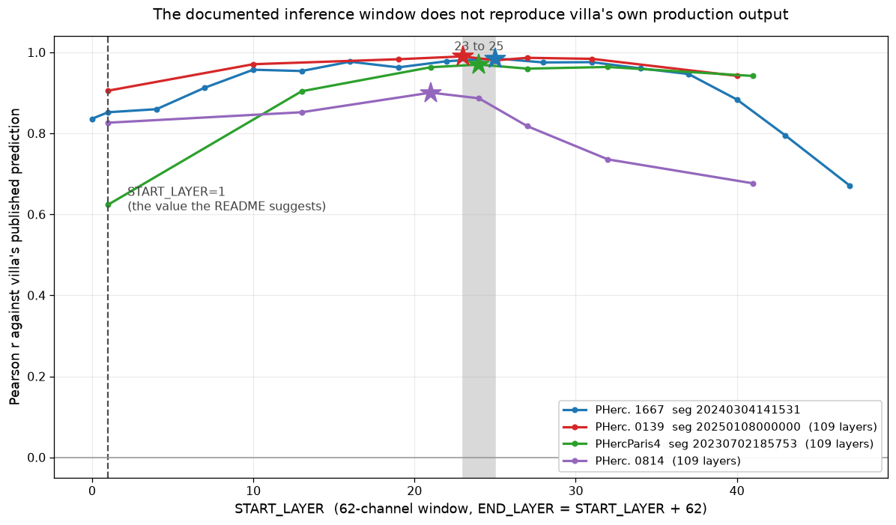
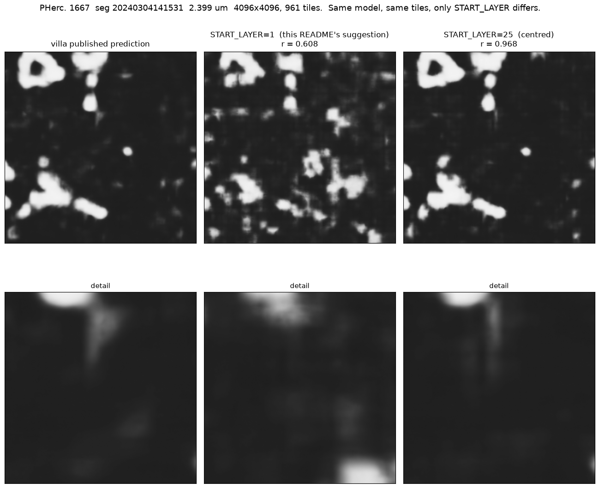
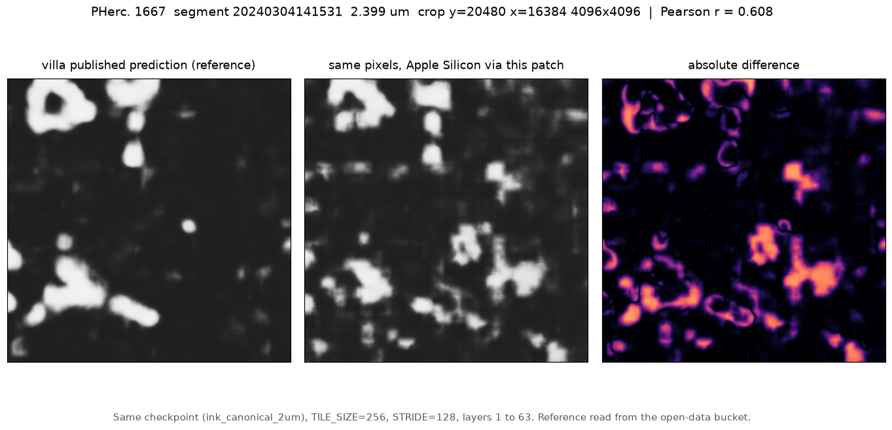

# Apple Silicon support for villa's ink detection inference

`villa/ink-detection/optimized_inference` selects its device with

```python
device = torch.device("cuda" if torch.cuda.is_available() else "cpu")
```

There is no MPS branch, so every Apple Silicon Mac silently takes the CPU path.
Downstream of that, the autocast device type is chosen as

```python
amp_device = "cuda" if device.type == "cuda" else "cpu"
```

which, when the tensors are on MPS, makes autocast a no-op rather than an
error.

This repository holds a small patch that adds the MPS path, plus the
measurements behind it and a local runner that needs no container and no AWS
credentials. Everything is measured on real scroll data: PHerc. 1667, segment
`20240304141531-w013_20240304141531_flatboi`, the 2.399 um surface volume, with
`scrollprize/ink_canonical_2um` (`r152_3ddec_v2_l5_epoch13.ckpt`).

## What it buys

Same checkpoint, same tiles, `TILE_SIZE=256`, `STRIDE=128`, layers 1 to 63,
loaded through villa's own `model_resnet3d_3d_decoder.load_model`.

Nine timed repetitions per MPS configuration and three for CPU, after an
untimed warmup, reported as min / median / max per villa's `AGENTS.md` rule
1.4 rather than as a bare mean.

| path | min | **median** | max | forward memory |
|---|---|---|---|---|
| CPU, fp32, what a Mac gets today | 3.259 | **3.261** | 3.278 | **9.53 GB** |
| MPS, autocast off | 0.524 | 0.525 | 0.526 | 2.59 GB |
| MPS, villa's current `amp_device` | 0.525 | 0.526 | 0.527 | 2.59 GB |
| MPS, `amp_device` corrected | 0.426 | **0.427** | 0.428 | 7.85 GB at batch 4 |

Seconds per tile. **7.63x faster.** Note rows two and three: villa's current
autocast line times identically to autocast being switched off, which is the
same no-op shown numerically below. The memory number matters more than the speed one. The CPU
path costs about **9.9 GB per tile** (9.53 GB at batch 1, 19.89 GB at batch 2),
so on a 16 GB Mac one tile barely fits and two do not. MPS at batch 4 needs
7.85 GB. For most Macs this is the difference between running the inference and
not running it.

Each configuration was measured in a **fresh process**, because `ru_maxrss` is
a process-wide high-water mark and a single-process sweep reports the maximum
of everything that ran before it.

**The two memory figures are different quantities**, and the column is only
meaningful if you read them as such: the CPU rows are `forward_rss_delta_gb`,
the host RSS the forward pass adds, and the MPS rows are
`mps_driver_allocated_gb`, what the Metal driver holds for it. Both come from
`bench/mem_probe.py`; `bench/mem_summary.py` regenerates all four rows in fresh
processes into `results/mem_probe_summary.json`.

### Reproducing

`bench/verify_claims.py` re-derives every number quoted here from the JSON in
`results/` and exits nonzero if any artifact and result file disagree:
**51 claims, 0 disagreements**. It needs nothing but this repo.

Re-running the MEASUREMENTS additionally needs a villa checkout and the
1.55 GB `r152_3ddec_v2_l5_epoch13.ckpt`, neither of which is redistributed
here. Point `VESUV_ROOT` at a directory holding `villa/` and `models/` and the
bench scripts will find them.

### Why the CPU path is so expensive

Sampling the CPU run shows the time going into
`at::native::slow_conv3d_forward_out_cpu` and `cpublas_gemm_impl`. PyTorch has
no optimised 3D convolution kernel for this case on arm64, so it falls back to
the reference implementation. The patch does not fix that; it is the reason the
MPS path is worth having.

### A separate finding, worth its own look: CPU autocast is catastrophic on arm64

This one is not about Apple Silicon specifically and the patch deliberately
does **not** change it, because changing CPU behaviour would alter what every
existing CPU user gets.

`inference.py` wraps the forward in `torch.autocast(device_type=amp_device,
enabled=True)`, and on any non-CUDA device `amp_device` is `"cpu"`. On arm64
that routes the 3D convolutions into a **bfloat16** reference kernel:

| CPU forward, one tile, batch 1 | seconds |
|---|---|
| fp32, autocast off | **3.47** |
| bf16, via `torch.autocast(device_type="cpu")` | **killed at 714, still running** |

That is a penalty of **at least 206x**, and it is a lower bound rather than a
measurement because the run was killed rather than completed. Attributed by
sampling, not assumed: the stack shows `BFloat16` symbols above
`at::native::slow_conv3d_forward_out_cpu` and `cpublas_gemm_impl`, so bf16 uses
the same reference convolution with no optimised GEMM behind it.

The practical effect is that a 49-tile crop that takes 21 s on MPS did not
finish in 33 minutes on CPU. Anyone running this on an arm64 CPU is likely to
read that as a hang. Whether the right fix is to disable autocast on CPU, gate
it on architecture, or leave it is a call for the maintainers, so this is
reported rather than patched.

### The autocast line is a silent no-op, not just mis-specified

Running autocast with `device_type="cpu"` while the tensors are on MPS produces
output **bit-identical to fp32**, max absolute difference exactly `0.0`. With
`device_type="mps"` the output differs by `1.24e-03`, which is fp16 magnitude,
and it is 1.23x faster. So Apple Silicon users are not getting a slightly wrong
autocast, they are getting none at all, with no error and no warning.

## Correctness

Three separate questions, kept separate because they have different answers.

### 1. Does the patch change what the model computes? No.

Same fixed input, CPU against MPS, single forward:

| comparison | max absolute difference |
|---|---|
| CPU vs MPS, same input | **9.54e-07** |
| CPU vs MPS, DIFFERENT input (negative control) | 0.165 |

The negative control is there because an agreement of ~0 with nothing to
compare it against would only prove the model ignores its input. It
discriminates by five orders of magnitude.

### 2. How much does correcting `amp_device` change the real output?

This is the question `AGENTS.md` 1.3 asks, so it is measured end to end on a
real crop rather than on a single tensor. villa's full pipeline, same 1024x1024
crop, 49 tiles, run twice on MPS with only the autocast device type differing:

| | |
|---|---|
| wall clock, current `amp_device` | 25.37 s |
| wall clock, corrected | 20.84 s (**1.217x**) |
| Pearson between the two outputs | **0.9999995** |
| mean absolute difference | 1.37e-04 |
| 99th percentile absolute difference | 1.78e-03 |
| max absolute difference | 3.17e-03 |
| **pixels whose ink/no-ink decision at 0.5 flips** | **0.014%** |

So the precision relaxation is real and it is small: 138 pixels in a million
change side of the 0.5 threshold. That is the trade, stated so it can be judged
rather than assumed.

### 3. Does the output match villa's published prediction? Yes, at r = 0.99,
### once the depth window is right. That turned out to be the real finding.

Comparing to the published map for the same segment
(`...new_canon_autoresearch_recipe-tile256-stride128.tif`), which sits on the
same grid as the level-0 surface so crops map one to one, the agreement
depends almost entirely on `START_LAYER`:

| scroll | measurements | r at START_LAYER **1** | best START_LAYER | r there |
|---|---|---|---|---|
| PHerc0139 | 3 | 0.1591 to 0.9054 | 23, 24 | 0.8525 to 0.9900 |
| PHerc0814 | 3 | 0.4324 to 0.8263 | 21, 24 | 0.8708 to 0.9239 |
| PHerc1667 | 6 | 0.6414 to 0.9039 | 24, 25 | 0.8886 to 0.9851 |
| PHercParis4 | 3 | 0.6240 to 0.9522 | 21, 24 | 0.9698 to 0.9848 |

**15 independent measurements across 4 scrolls, and the best window beats
`START_LAYER=1` in 15 of 15.** Best START_LAYER is 21 to 25, median
24. That grid does not separate 23 from 24; measured PAIRED on the same
15 crops they are level, **23 wins 8, 24 wins 7, sign test p = 1.0000**,
median paired difference +0.0017 in r. All the volumes are 109
layers, so the centred window is `(109-62)//2 = 23`.

Agreement at the documented setting ranges from **0.1591 to 0.9522** (median
0.7474); at the best window it is 0.8525 to 0.99 (median 0.9698). On the worst
segment the documented window drops agreement to **0.1591**.

Each comparison window was chosen automatically as a high-variance region of
villa's own reference, never by hand, and every offset on every segment was
also scored against a **shuffled** copy of that reference. That floor never
exceeds **0.0022**.



The same pixels at both settings, so the cost is visible rather than only
numerical. Top row is the full 4096 crop, bottom row is the same detail from
each:




**`START_LAYER=1` does not reproduce villa's own production output. About 21
to 25 does, and 23 is a reasonable single default for a 109-layer volume.**

### Adversarial checks on that finding

A peak alone is not evidence, so four things were checked that could each have
explained it away. All are in `results/stress_window.json`.

| check | question | result |
|---|---|---|
| S1 | is r merely tracking how much ink the output has? | **no.** r peaks at START_LAYER 25, mean ink at 19, separation at 28. They do not coincide |
| S2 | does it survive rank correlation? | **yes.** Spearman peaks at 22, invariant to any monotone recalibration |
| S3 | is the peak carried by only one side of the reference? | **no.** Scoring only the pixels the reference calls ink peaks at 25, the same place |
| S4 | shuffled-reference floor | 0.0013 |

S3 is the most direct of the four. On the pixels that actually contain ink,
agreement goes from **0.4993 at START_LAYER 1** to
**0.8592 at START_LAYER 25**.

Corroborated by a metric that never looks at the reference: the ink separation
of our own output (mean of pixels above 0.5 minus mean of those below) also
peaks in that region, 0.7210 at START_LAYER 28 against 0.6643 at START_LAYER 1.

### This is villa's own convention everywhere else

Centring is not an inference from my measurements. It is what the rest of the
repo and the model cards already do, and `START_LAYER=1` in this one document
is the outlier.

- **`scrollprize/hecate`** (released 2026-09-15, built from `ink_canonical_2um`),
  on its own inference script: "The script **selects the central input depth**,
  slides over XY with half-patch overlap, and blends probabilities using a
  floored Hann window." Its `--reverse` flag "reverse[s] the **full render
  depth before selecting the central planes**".
- **The same card on why the centre is the reference at all:** "A
  surface-conditioned render (surface volume) is a CT scan **resampled around a
  mesh** that follows a papyrus sheet... The intended sheet can also **wander
  above and below the centre of the render**."
- **`vesuvius/docs/ink_detection.md`**, for a 2.399 um OME-Zarr: "**select the
  centered 84 Z planes**", and "**Labels occupy Z slice 32 of a 65-plane
  volume**", which is the exact centre.
- **`scrollprize/ink_9um`**: "the z window **jitters over 17 of the 21 slices**
  so the models don't lock onto one exact depth", which is the same fact
  handled as a training augmentation.

The wandering sheet also explains why the measured optima scatter over 21 to 25
instead of sitting exactly on the centred 23: the centre is where the mesh is,
and the sheet is near it rather than on it. That per-segment offset is worth
measuring rather than assuming, which is what `bench/inkdiag.py` does.

Separately, my `depth_reverse` null puts a number on the directionality their
`--reverse` flag exists for: flipping the depth axis takes confident ink from
0.4138 to 0.0131 on the same crop.

### Stability

| | best START_LAYER |
|---|---|
| four scrolls, one region each | 25, 23, 24, 21 |
| PHerc. 1667, three further regions | 24, 24, 24 |

Seven independent measurements, all within 21 to 25, against a centred value
of 23.



Left is the published prediction, middle is the same pixels through this patch
on MPS, right is the absolute difference. 4096x4096, 961 tiles, at the
corrected `START_LAYER=25`: **Pearson 0.9685, Spearman 0.7702**, against
**0.608 / 0.275** on the identical pixels at `START_LAYER=1`. Best negative
control 0.056, shuffled reference 0.000.

## Is it reading ink, or inventing it?

Same crop, same model, at the corrected window `START_LAYER=25`. Each null
destroys structure while preserving something stated, and `frac>0.5` is the
share of pixels called confident ink. Real input gives **0.4138**.

| input | frac>0.5 | Pearson vs the real prediction |
|---|---|---|
| **real data** | **0.4138** | 1.000 |
| `depth_shuffle` | 0.0000 | -0.069 |
| `per_column_shuffle` | 0.0000 | +0.031 |
| `single_layer_repeat` | 0.0000 | +0.008 |
| `voxel_shuffle` | 0.0000 | +0.006 |
| `phase_scramble` | 0.0112 | +0.244 |
| `depth_reverse` | 0.0131 | +0.313 |
| `depth_roll_half` | 0.1429 | +0.423 |

What each null preserves:

- `single_layer_repeat` every layer replaced by a copy of the middle one, so
  in-plane texture is perfect and **all** depth information is gone
- `depth_shuffle` layer order permuted, every voxel value kept
- `per_column_shuffle` independent depth permutation per column
- `voxel_shuffle` global histogram only
- `phase_scramble` amplitude spectrum kept, in-plane phase randomised
- `depth_reverse` everything kept except direction
- `depth_roll_half` cyclic depth shift, local adjacency mostly kept

**The decisive one is `single_layer_repeat`: perfect 2D texture, no depth
information, and the model calls no ink at all.** So it is not a 2D texture
reader, which is the simplest version of the hallucination worry and it is
ruled out. `depth_shuffle`, `per_column_shuffle` and `voxel_shuffle` are also
exactly zero.

`depth_reverse` collapsing to 0.0131 says the model is strongly
**directional**: flipping the depth axis, which preserves every other
property, nearly removes the detection.

### The window changes the hallucination rate, which makes this a diagnostic

Running the identical nulls at `START_LAYER=1` instead of 25:

| null | frac>0.5 at START_LAYER **25** | at START_LAYER **1** |
|---|---|---|
| `depth_shuffle` | **0.0000** | **0.0732**, and anti-correlated with the real prediction (-0.175) |
| `phase_scramble` | 0.0112 | 0.0084 |
| `voxel_shuffle` | 0.0000 | 0.0000 |

**Operating outside the right window does not merely lower agreement, it makes
the model assert confident ink on input whose depth ordering has been
destroyed.** That is a usable signal: if your nulls come back with confident
ink, suspect your window before you suspect the scan.

## inkdiag: which failure mode am I fighting?

The 2026 open problems put it directly: when a model shows no ink, "the right
conclusion is neither 'the scan failed' nor 'the model failed'", six
explanations stay open, and "better diagnostics matter just as much as better
models". `bench/inkdiag.py` measures two things that separate them.

**Sweep the window.** Slide the 62-plane input through depth and record the
output at each position. Then:

| what you see | what it means | what to do |
|---|---|---|
| peak at the centred window, high separation | real signal, correctly located | nothing |
| peak displaced by N planes from centred | the surface is mislocalised by about N | re-localise the surface |
| no confident ink at ANY window | no detectable signal here | scan or chemistry, not the model |
| confident ink only at wrong windows, none at the centred one | **false positives from misconfiguration** | fix the window before blaming the scan |

**Run the nulls.** Destroy structure while preserving stated properties and
see what survives. If confident ink survives `single_layer_repeat`, which
keeps in-plane texture perfectly and removes all depth information, the output
is 2D texture and not ink.

### The two signatures, measured on the same segment

PHerc. 1667, 20240304141531, two 1024 crops: one ink-rich (reference std
0.362) and one blank (reference std 0.0116).

| | ink region | blank region |
|---|---|---|
| confident ink at the centred window | **0.4138** | **0.0000** |
| confident ink at `START_LAYER=1` | 0.3323 | 0.0167 |
| separation at the centred window | 0.7144 | negative, nothing above 0.5 |
| best agreement with the published map | 0.9851 | 0.2660 |

The blank region produces **no** confident ink at the centred window and at
every window from 10 to 103. It produces 1.67% at `START_LAYER=1`.

**So the wrong window manufactures false positives twice over**: on blank
papyrus, and on structurally destroyed input (the `depth_shuffle` null goes
from 0.0000 at the centred window to 0.0732 at `START_LAYER=1`, anti-correlated
with the real prediction). Both point the same way, and neither would be
visible to someone looking only at their prediction image.

    python bench/inkdiag.py --y0 20480 --x0 16384 --size 1024 \
      --offsets=-1,0,9,18,23,25,28,34,46

## hecate, their newest model, on Apple Silicon

`scrollprize/hecate` was released 2026-09-15 and is built from the same
`ink_canonical_2um`. It ships its own `hecate.py`, and it **already writes its
autocast correctly** as `torch.autocast(device_type=device.type, ...)`, which
is exactly the change this patch makes to `optimized_inference`.

Run at 2.4 um on a real PHerc. 1667 crop (109 x 1024 x 1024, 49 patches):

| | |
|---|---|
| `--device mps` | **29.3 s** and **29.1 s** |
| `--device cpu` | 167.7 s |
| speedup | **5.76x** |
| MPS against CPU output | 13 pixels of 1048576 differ, by one quantisation step |
| MPS run to run | bit identical, 0 pixels differ |

So hecate needs no patch to run on Apple Silicon. Its one remaining gap is the
same one this repo fixes for `optimized_inference`: `--device` defaults to
`'cuda' if torch.cuda.is_available() else 'cpu'`, so a Mac silently takes the
5.76x slower path unless the user knows to pass `--device mps`.

A caution found the hard way: `hecate.py` refuses to overwrite an existing
output file. A rerun that "finishes" in under a second has not run, it has
printed an error. Read the log, not the wall clock.

## Also here: running it locally

`entrypoint.py` assumes `/workspace` and a credentialed `boto3` client, so it
cannot be run outside the container. `bench/run_local.py` reads a crop straight
from `s3://vesuvius-challenge-open-data/` anonymously and hands it to villa's
own `run_inference` unmodified, with no container and no credentials:

```bash
python bench/run_local.py --y0 20480 --x0 16384 --size 1024
```

Two notes for anyone reading zarr from that bucket:

- zarr 3 needs an **async** fsspec filesystem. Use
  `zarr.storage.FsspecStore.from_url("s3://...", storage_options={"anon": True})`;
  passing a plain `S3FileSystem` raises `Filesystem needs to support async
  operations`.
- `s3fs` must be recent. Installing without a version bound can resolve
  `s3fs==0.4.2`, which fails with
  `Session.__init__() got an unexpected keyword argument 'asynchronous'`.
  villa's own `requirements.txt` already pins `>=2024.3.0`; this is only a
  warning for anyone installing by hand.

## The patch

`device_utils.py` plus six changed lines, in `villa-apple-silicon.patch`.

- `select_device()`: cuda, then mps, then cpu, with an `INK_DEVICE` override.
- `amp_device_type(device)`: follows the device the tensors are actually on,
  and falls back to `cpu` for anything it does not recognise.
- `sync(device)` and `empty_cache(device)` so timing and cache clearing are not
  cuda-only.

## Controls

`bench/verify_port.py`, 12 checks, 0 failures. The check that matters is not
"does MPS work", it is **"is the CUDA path unchanged"**, since that is the path
every existing user is on.

**Stated plainly: there is no CUDA hardware here, so the CUDA path is verified
by unit test and by construction, never by execution.** `amp_device_type` is
asserted on every branch and `select_device` is tested with
`torch.cuda.is_available` monkeypatched to `True`. A positive control watches
villa's original expression returning `"cpu"` for an MPS device, so if that is
ever fixed upstream the control fails loudly instead of passing vacuously.

## Honest negatives

- **Batching buys almost nothing on MPS.** Throughput is flat from batch 1 to
  16 (2.33 to 2.39 tiles/s), so the model already saturates the GPU at batch 1.
  Batch 16 needs 27.08 GB of driver-allocated memory for a 1.25x gain. Batch 4
  is the sensible default.
- `torch.compile` does work on MPS in both `reduce-overhead` and `default`
  modes, warmup 14.1 s and 12.5 s, output matching eager to `1.36e-03`. It
  emits CUDA-specific warnings ("Not enough SMs", "skipping cudagraphs due to
  multiple devices") which are cosmetic.
- MPS refuses `float64`. Nothing in this path hits it, but anything that does
  will need casting.

## Everything here is machine-checked

`bench/verify_claims.py` re-derives every number quoted in this README from the
raw JSON in `results/` and fails if any of them drifts. **44 claims, 0
disagreements.** It also refuses em dashes and refuses any claim this work has
since withdrawn, so a superseded figure cannot survive an edit.

It has been watched failing: planting a stale speedup into this README makes it
exit 1 and name the two checks that catch it.

    python bench/verify_claims.py

## Reproducing

```bash
git clone https://github.com/ScrollPrize/villa.git
uv venv env --python 3.11
uv pip install --python ./env/bin/python torch numpy scipy tqdm \
  opencv-python-headless tifffile psutil huggingface_hub boto3 \
  "s3fs>=2025.1.0" fsspec zarr numcodecs imagecodecs albumentations matplotlib
git -C villa apply ../villa-apple-silicon.patch

./env/bin/python bench/feasibility.py      # what MPS supports, and the bucket
./env/bin/python bench/verify_port.py      # the 12 controls
./env/bin/python bench/bench_device.py     # CPU vs MPS, with a negative control
./env/bin/python bench/run_local.py        # a real crop, end to end
./env/bin/python bench/compare_reference.py --y0 20480 --x0 16384 --tag ink
```

Measured on an M1 Max, 64 GB, macOS 26.6, torch 2.14.0, python 3.11.15.

MIT licensed, same as villa.

### bf16 on Apple Silicon: measured, and it is the wrong thing to want

`hecate.py:322` refuses bf16 on anything but CUDA:

```python
if precision not in ('fp32', 'bf16') or (precision == 'bf16' and device.type != 'cuda'):
    raise ValueError('bf16 requires CUDA; otherwise use fp32')
```

MPS does support bfloat16, so that guard looks like something to relax. The
model card is careful to say only that "Float32 and CUDA bfloat16 were tested",
leaving MPS bf16 as an open cell rather than claiming anything about it. Filling
it in says leave the guard alone.

`bench/hecate_bf16.py` changes exactly that one line to
`device.type not in ('cuda', 'mps')` and changes nothing else, then runs the
same pipeline both ways on the same 109 x 1024 x 1024 PHerc. 1667 crop, one
untimed warmup and three timed repetitions each.

| `--precision` on MPS | min | median | max |
|---|---|---|---|
| `fp32` | 26.255 | **26.284** | 26.374 |
| `bf16` | 40.301 | **40.356** | 41.110 |

**bf16 is 1.54x slower**, and it is also less accurate: max absolute difference
6 of 255, mean 0.190, 14.58% of pixels differ, and **813 of 1,048,576 pixels
cross the 0.5 ink threshold**. Slower and worse on both axes, so the CUDA-only
guard costs Apple Silicon nothing and is correct as written.

The negative control runs first and is asserted, not printed: the unmodified
module must refuse bf16 on MPS, and it does, with its own message. Without that,
a variant that silently fell back to fp32 would produce two identical timings
and look like a pass.

Raw numbers in `results/hecate_bf16.json`.

<!-- hecate-fp16:start -->
### fp16 on Apple Silicon: the half precision that does help

The opposite result for fp16. `bench/hecate_fp16.py` runs the same pipeline on
the same crop, in one process, fp32 then fp16, one untimed warmup and three timed
repetitions each. The only change to `hecate.py` is three lines: accept `fp16`
in the precision check for cuda or mps, pass `dtype=torch.float16` to the
existing autocast when it is selected, and add it to the `--precision` choices.
fp32 stays the default.

| `--precision` on MPS | min | median | max |
|---|---|---|---|
| `fp32` | 30.280 | **30.313** | 30.545 |
| `fp16` | 22.391 | **22.581** | 25.248 |

**fp16 is 1.34x faster on the median.** Against the fp32 output
the largest difference is 1 of 255, 1.67% of pixels move by
one quantisation step, and **66 of 1,048,576 pixels cross the 0.5 ink
threshold**, against 813 for bf16. Both precisions ran in the same process under
the same machine load, which is why fp32 here reads slower than in the bf16 table
above: compare within a table, not across them.

The unmodified module is asserted to refuse `fp16` first, so a variant that
silently ran fp32 twice could not pass as a speedup. Raw numbers in
`results/hecate_fp16.json`.
<!-- hecate-fp16:end -->

<!-- armx:start -->
## Does the First Letters ink model transfer to scrolls it never trained on?

**Read the PHerc0841 figures in this section as a property of the organisers' 4.681 um renders, not of the scroll.** On the published surface volumes of the same three segments (next section) the primary checkpoint's median is 0.8294 at 2.403 um and 0.7614 on the eligible 9.366 um scan, against 0.6931 on the renders here, and only the renders need reversing. The PHerc0500P2 500p2a result was measured on a render only.

`scrollprize/ink_9um` is the model the First Letters workflow runs at the eligible
8.6 to 9.4 um resolution, and it is the instrument behind the published First
Letters negatives. Its card lists its four training scrolls and reports no number
on any other. The organisers' own label bucket
(`huggingface.co/buckets/scrollprize/datasets`, tree `ink/`) holds labelled renders
of scrolls outside that set, so the question can be answered on their labels rather
than on a proxy. This was pre-registered before any inference (primary endpoint,
verdict bands, controls), and the numbers below are printed from
`results/xs/armx_scores.json` by `bench/xs_report.py`, not typed.

Method, in one paragraph. Each labelled render (65 planes at 4.32 or 4.681 um) is
mean-pooled 2x2x2, which lands exactly on the eligible 8.64 and 9.362 um grids; its
2D labels pool as "at least 2 of 4 ink". Inference is villa's own
`vesuvius.ink_detection.inference.infer`, called in-process, with one change: the
non-CUDA device branch returns MPS (the same change as villa #1865). Both depth
directions run, and a label-free rule picks one per segment: the direction whose
output separates more (mean of p above 0.5 minus mean of p at or below 0.5).
AUC is exact (uint8 scores, 256-bin histograms) with a 64 px block bootstrap.

Generated by `ops/xs_report.py` from `results/xs/armx_scores.json`. Pre-registration: PREREGISTRATION.md, amendment 2026-09-22 23:3x.

### Gate and verdict, as pre-registered

- C1, primary checkpoint on pherc0139-w016 validation pixels: **0.7740** (forward), bar 0.85: **FAIL**
- Diagnostic added after that failure: seed43 step-060000, same pipeline, same pixels: **0.9123** (kadenpool, villa #1845: 0.912)
- Verdict: **UNDECIDED: C1 failed, or a primary segment is missing or undecided**


### Primary checkpoint (seed42 step-075000), every segment

| segment | ink rate | forward | reverse | label-free pick | AUC picked | 95% block CI |
|---|---|---|---|---|---|---|
| PHerc0139 w016 (C1, in distribution) | 0.232 | 0.7740 | 0.5510 | forward | **0.7740** | 0.693 to 0.836 |
| MAN5 outer_3 (exploratory) | 0.286 | 0.4949 | 0.4767 | reverse | **0.4767** | 0.444 to 0.508 |
| PHerc0009B (exploratory) | 0.320 | 0.5267 | 0.7462 | reverse | **0.7462** | 0.731 to 0.765 |
| PHerc0500P2 -1 (exploratory) | 0.368 | 0.5466 | 0.7025 | reverse | **0.7025** | 0.686 to 0.721 |
| PHerc0500P2 500p2a | 0.351 | 0.4912 | 0.4961 | forward | **0.4912** | 0.474 to 0.509 |
| PHerc0841 ag144 | 0.333 | 0.5984 | 0.6989 | reverse | **0.6989** | 0.664 to 0.735 |
| PHerc0841 ag174 | 0.324 | 0.5438 | 0.6743 | reverse | **0.6743** | 0.632 to 0.713 |
| PHerc0841 w00 | 0.320 | 0.5291 | 0.6931 | reverse | **0.6931** | 0.667 to 0.718 |

### Every checkpoint: in distribution against held out

| checkpoint | C1, in distribution | median over held-out primary segments | label-free pick = better direction |
|---|---|---|---|
| ensemble_seed42+43_final | 0.9130 | 0.6889 (4 of 4) | 7 of 8 |
| seed42_step-010000 | 0.8932 | 0.6618 (4 of 4) | 4 of 5 |
| seed42_step-020000 | 0.9141 | 0.6528 (4 of 4) | 4 of 5 |
| seed42_step-030000 | 0.8175 | 0.6616 (4 of 4) | 4 of 5 |
| seed42_step-040000 | 0.8181 | 0.6741 (4 of 4) | 5 of 5 |
| seed42_step-050000 | 0.8109 | 0.6589 (4 of 4) | 4 of 5 |
| seed42_step-060000 | 0.8107 | 0.6708 (4 of 4) | 4 of 5 |
| seed42_step-075000 | 0.7740 | 0.6837 (4 of 4) | 6 of 8 |
| seed43_step-010000 | 0.5363 | 0.6366 (4 of 4) | 3 of 5 |
| seed43_step-020000 | 0.5430 | 0.6613 (4 of 4) | 4 of 5 |
| seed43_step-030000 | 0.8786 | 0.6198 (4 of 4) | 5 of 5 |
| seed43_step-040000 | 0.9147 | 0.6433 (4 of 4) | 4 of 5 |
| seed43_step-050000 | 0.9132 | 0.6764 (4 of 4) | 4 of 5 |
| seed43_step-060000 | 0.9123 | 0.6492 (4 of 4) | 4 of 5 |
| seed43_step-075000 | 0.9365 | 0.6738 (4 of 4) | 6 of 8 |

Across 14 checkpoints, Spearman between in-distribution and held-out AUC: **-0.011** (p = 0.97).

### Every checkpoint on every segment, direction chosen without labels

| checkpoint | PHerc0139 w016 | PHerc0841 w00 | PHerc0841 ag144 | PHerc0841 ag174 | PHerc0500P2 500p2a |
|---|---|---|---|---|---|
| ensemble_seed42+43_final | 0.9130 | 0.7150 | 0.7465 | 0.6628 | 0.4860 |
| seed42_step-010000 | 0.8932 | 0.6568 | 0.6829 | 0.6668 | 0.4784 |
| seed42_step-020000 | 0.9141 | 0.6753 | 0.7009 | 0.6303 | 0.4765 |
| seed42_step-030000 | 0.8175 | 0.6882 | 0.6745 | 0.6486 | 0.4983 |
| seed42_step-040000 | 0.8181 | 0.6793 | 0.6889 | 0.6690 | 0.4977 |
| seed42_step-050000 | 0.8109 | 0.6479 | 0.6946 | 0.6699 | 0.4753 |
| seed42_step-060000 | 0.8107 | 0.6713 | 0.6901 | 0.6702 | 0.4886 |
| seed42_step-075000 | 0.7740 | 0.6931 | 0.6989 | 0.6743 | 0.4912 |
| seed43_step-010000 | 0.5363 | 0.6508 | 0.6724 | 0.6224 | 0.4639 |
| seed43_step-020000 | 0.5430 | 0.6855 | 0.7393 | 0.6372 | 0.4753 |
| seed43_step-030000 | 0.8786 | 0.6381 | 0.6886 | 0.6014 | 0.4941 |
| seed43_step-040000 | 0.9147 | 0.6579 | 0.7346 | 0.6288 | 0.4760 |
| seed43_step-050000 | 0.9132 | 0.7094 | 0.7285 | 0.6434 | 0.4747 |
| seed43_step-060000 | 0.9123 | 0.6722 | 0.7273 | 0.6262 | 0.4821 |
| seed43_step-075000 | 0.9365 | 0.7055 | 0.7491 | 0.6422 | 0.4760 |

Across 14 checkpoints, Spearman between in-distribution AUC and the PHerc0841 median: **0.160** (p = 0.584).

### Per source: PHerc0841 (a scroll, three segments) and PHerc0500P2 500p2a (a detached fragment)

| checkpoint | PHerc0841 median | PHerc0500P2 500p2a |
|---|---|---|
| ensemble_seed42+43_final | 0.7150 | 0.4860 |
| seed42_step-010000 | 0.6668 | 0.4784 |
| seed42_step-020000 | 0.6753 | 0.4765 |
| seed42_step-030000 | 0.6745 | 0.4983 |
| seed42_step-040000 | 0.6793 | 0.4977 |
| seed42_step-050000 | 0.6699 | 0.4753 |
| seed42_step-060000 | 0.6713 | 0.4886 |
| seed42_step-075000 | 0.6931 | 0.4912 |
| seed43_step-010000 | 0.6508 | 0.4639 |
| seed43_step-020000 | 0.6855 | 0.4753 |
| seed43_step-030000 | 0.6381 | 0.4941 |
| seed43_step-040000 | 0.6579 | 0.4760 |
| seed43_step-050000 | 0.7094 | 0.4747 |
| seed43_step-060000 | 0.6722 | 0.4821 |
| seed43_step-075000 | 0.7055 | 0.4760 |

Mean CT intensity across the pooled planes (every 8th supported pixel, `results/xs/depth_profiles.json`): PHerc0139 w016 (C1, in distribution) 57.2 to 80.6; PHerc0500P2 500p2a 51.3 to 92.6; PHerc0841 ag144 89.8 to 94.9; PHerc0841 ag174 83.7 to 92.1; PHerc0841 w00 90.7 to 96.1. The fragment's intensity falls to 51.3 on one side of its window, consistent with an exposed surface; the PHerc0841 renders stay at or above 83.7.

### Exploratory, not pre-registered: is held-out AUC depressed by window placement?

The 17-plane window shifted by k pooled planes, in the direction the label-free rule picked, primary checkpoint.

| segment | direction | k = -4 | k = -2 | k = 0 | k = +2 | k = +4 |
|---|---|---|---|---|---|---|
| PHerc0500P2 500p2a | forward | 0.4760 | 0.4839 | 0.4912 | 0.4859 | 0.4628 |
| PHerc0841 ag144 | reverse | 0.7051 | 0.6975 | 0.6989 | 0.6915 | 0.6366 |
| PHerc0841 ag174 | reverse | 0.6955 | 0.6863 | 0.6743 | 0.6974 | 0.6962 |

Direction: over the pre-registered segments the label-free rule kept the better direction in 57 of 70 (segment, checkpoint) cases (61 of 76 including the 3 exploratory segments); the largest forward-reverse gap on a held-out segment is 0.2094.
Window placement: the largest gain from any shift in the exploratory check is 0.0231.

### Controls

- C2 block-shuffle floor, pre-registered bar every seed within 0.03 of 0.5: **FAIL** (worst deviation 0.1199)
  - PHerc0139 w016 (C1, in distribution): median 0.4791, range 0.3801 to 0.5655
  - MAN5 outer_3 (exploratory): median 0.4989, range 0.4761 to 0.5316
  - PHerc0009B (exploratory): median 0.4978, range 0.4712 to 0.5201
  - PHerc0500P2 -1 (exploratory): median 0.4958, range 0.4619 to 0.5195
  - PHerc0500P2 500p2a: median 0.5020, range 0.4851 to 0.5108
  - PHerc0841 ag144: median 0.4985, range 0.4693 to 0.5214
  - PHerc0841 ag174: median 0.4999, range 0.4731 to 0.5465
  - PHerc0841 w00: median 0.5052, range 0.4669 to 0.5306
<!-- armx:end -->

<!-- armyz:start -->
## The same PHerc0841 segments on the published surface volumes, including the eligible scan

The organisers publish these three PHerc0841 segments in more than one form: the
65-plane 4.681 um renders in the label bucket, from the 1.2 m, 113 keV scan (what the
section above used), and surface volumes on the open-data bucket at 2.403 um (0.22 m,
77 keV, 109 layers) and at 9.366 um (the 1.2 m, 113 keV scan, 28 layers, the eligible
First Letters grid). This was prompted by liliandevarieux on villa #1867, pre-registered
before inference, and scored on the organisers' published 20260918 labels. The 2.403 um
input goes through villa's own `prepare_9um_isotropic_input`; the 9.366 um input is its
centred 21 layers, with the labels moved onto that canvas after an alignment check.

Generated by `ops/yz_report.py` from the JSON. Pre-registrations: `results/ys/PREREGISTRATION_ARMY.md`, `results/zs/PREREGISTRATION_ARMZ.md`.

### One checkpoint, three arrays

ink_9um seed42 step-075000, both depth directions, label-free choice (larger separation). AUC against the organisers' labels.

| array | w00 | ag144 | ag174 | median | order the labels prefer |
|---|---|---|---|---|---|
| 4.681 um render, label bucket (ARM X) | 0.6931 | 0.6989 | 0.6743 | **0.6931** | reversed on all three |
| 2.403 um surface volume, production 9 um recipe (ARM Y) | 0.8531 | 0.8176 | 0.8294 | **0.8294** | stored on all three |
| 9.366 um surface volume, eligible scan (ARM Z) | 0.7680 | 0.7599 | 0.7614 | **0.7614** | stored on all three |

In distribution, the same checkpoint scores **0.7740** on PHerc0139 w016 (ARM X, C1). The render row is scored against the label files that sit beside the renders in the label bucket; the two surface-volume rows use the published 20260918 labels, moved onto the 9.366 um canvas for the last row. The controls below check both label sets.

Stored order against reversed, same checkpoint:

| array | w00 | ag144 | ag174 |
|---|---|---|---|
| 4.681 um render | 0.5291 / 0.6931 | 0.5984 / 0.6989 | 0.5438 / 0.6743 |
| 2.403 um volume | 0.8531 / 0.5324 | 0.8176 / 0.5938 | 0.8294 / 0.5363 |
| 9.366 um volume | 0.7680 / 0.5631 | 0.7599 / 0.5440 | 0.7614 / 0.6033 |

Same labels, same segments, two representation families in villa's own terms (#1582): `public_2p4_level2_zmean4` minus `native` 9.366 um, w00 +0.0851, ag144 +0.0577, ag174 +0.0679; the pooled family is ahead on 3 of 3.

### Verdicts, as pre-registered

- Y1, direction: **SUPPORTED: direction is a property of the array**
- Y2, array: **input-array effect: at or above C1** (median 0.8294 on the 2.403 um volumes against 0.6931 on the renders)
- Z1, eligible scan: **between the two, as measured** (median 0.7614)
- Y3, slice: **slice does not matter on this array**

### Controls

- C4, the swept production window equals villa's own recipe bit for bit: w00 PASS, ag144 PASS, ag174 PASS
- C3, the organisers' own published prediction scored on the same labels and grid (bar 0.75): w00 0.9714, ag144 0.9206, ag174 0.8691
- Direction rule reproduces every stored ARM X choice: 84 of 84
- C2 block-shuffle floor, 2.403 um, 20 seeds: w00 median 0.4984 (range 0.4631 to 0.5311), ag144 median 0.4981 (range 0.4509 to 0.5722), ag174 median 0.5002 (range 0.4305 to 0.5542)
- C2 block-shuffle floor, 9.366 um, 20 seeds: w00 median 0.4928 (range 0.4468 to 0.5266), ag144 median 0.4970 (range 0.4551 to 0.5381), ag174 median 0.4929 (range 0.4293 to 0.5453)
- Z-ALIGN, 9.366 um canvas against the 2.403 um canvas: w00 offset (7, 8) px, peak NCC 0.6426, NCC at zero -0.0355, ag144 offset (6, 8) px, peak NCC 0.7410, NCC at zero -0.0100, ag174 offset (7, 7) px, peak NCC 0.7491, NCC at zero -0.0343

Added after the result and not pre-registered:

- Label offset sensitivity on the 9.366 um grid: the best offset within 2 px of the one used gains at most 0.0025, and zero offset loses at most 0.0050.
- The render labels are sound: on the w00 render the organisers' own stored predictions score `w00_canonical_030726_reverse_070326.tif` 0.8229, `ps48_640_640_smooth_0.1_w00_ckpt_130000_forward_210326.tif` 0.9492.

### The 84-plane window swept across the 109 layers (2.403 um, label-free direction)

| segment | planes 1 to 84 | planes 5 to 88 | planes 9 to 92 | planes 13 to 96 | planes 17 to 100 | planes 21 to 104 | planes 25 to 108 |
|---|---|---|---|---|---|---|---|
| w00 | 0.8243 | 0.8392 | 0.8485 | **0.8531** | 0.8507 | 0.8630 | 0.8618 |
| ag144 | 0.8002 | 0.8134 | 0.8221 | **0.8176** | 0.8314 | 0.8167 | 0.7979 |
| ag174 | 0.7794 | 0.8057 | 0.8267 | **0.8294** | 0.8342 | 0.8355 | 0.8197 |

Bold is villa's production window. w00: best w21 (0.8630), gain 0.0099. ag144: best w17 (0.8314), gain 0.0138. ag174: best w21 (0.8355), gain 0.0061.

### Every checkpoint (production window, label-free direction)

| checkpoint | in distribution (C1), as pre-registered | C1, correct direction | PHerc0841 median, render | PHerc0841 median, 2.403 um volume | PHerc0841 median, eligible 9.366 um |
|---|---|---|---|---|---|
| seed42_step-010000 | 0.8932 | 0.8932 | 0.6668 | 0.8290 | 0.7602 |
| seed42_step-020000 | 0.9141 | 0.9141 | 0.6753 | 0.8120 | 0.7207 |
| seed42_step-030000 | 0.8175 | 0.8175 | 0.6745 | 0.8250 | 0.7683 |
| seed42_step-040000 | 0.8181 | 0.8181 | 0.6793 | 0.8170 | 0.7486 |
| seed42_step-050000 | 0.8109 | 0.8109 | 0.6699 | 0.8175 | 0.7505 |
| seed42_step-060000 | 0.8107 | 0.8107 | 0.6713 | 0.8253 | 0.7557 |
| seed42_step-075000 | 0.7740 | 0.7740 | 0.6931 | 0.8294 | 0.7614 |
| seed43_step-010000 | 0.5363 | 0.8695 | 0.6508 | 0.8074 | 0.7289 |
| seed43_step-020000 | 0.5430 | 0.9201 | 0.6855 | 0.8512 | 0.7226 |
| seed43_step-030000 | 0.8786 | 0.8786 | 0.6381 | 0.7985 | 0.7106 |
| seed43_step-040000 | 0.9147 | 0.9147 | 0.6579 | 0.8041 | 0.7166 |
| seed43_step-050000 | 0.9132 | 0.9132 | 0.7094 | 0.8314 | 0.7796 |
| seed43_step-060000 | 0.9123 | 0.9123 | 0.6722 | 0.8005 | 0.7532 |
| seed43_step-075000 | 0.9365 | 0.9365 | 0.7055 | 0.8205 | 0.7583 |
| the two finals averaged | | | | | 0.7826 |

On C1 the label-free direction rule chose the wrong direction for 2 of the 14 (seed43_step-010000, seed43_step-020000), which is why the first two columns differ; the correct-direction column was added after the fact. On the 2.403 um volumes the rule kept the better direction in **42 of 42** (segment, checkpoint) pairs, on the eligible volumes in **42 of 42**.

Does anything cheap rank the checkpoints the way the published volumes do? Spearman across the 14:

| against | 2.403 um median | eligible 9.366 um median |
|---|---|---|
| C1, as pre-registered | -0.2967 | -0.0198 |
| C1, correct direction | -0.0725 | -0.3011 |
| render median | 0.6352 | 0.5429 |
| training step, seed42 | 0.3571 | 0.1786 |
| training step, seed43 | -0.0714 | 0.5714 |
| 2.403 um median | | 0.6396 |

Best single checkpoint on the 2.403 um volumes: seed43_step-020000 (**0.8512**); on the eligible volumes: seed43_step-050000 (**0.7796**), and the two finals averaged give **0.7826**.

Family gap over every (segment, checkpoint) pair: the pooled 2.4 um family is ahead in **42 of 42**, median 0.0819, range 0.0245 to 0.1533.
<!-- armyz:end -->

<!-- armf:start -->
## Why ink_9um reads the eligible 1.2 m scans worse

The sections above found ink_9um at a median AUC of 0.8294 on PHerc0841's 2.403 um volumes but 0.7614 on the
eligible 9.366 um ones, for the same segments and labels. Every First Letters volume is a 1.2 m scan like the
latter, so this asks what the model loses there and whether a fixed input transform, fitted without labels,
gets it back. Usable today: `bench/depth_sharpen_9um.py` applies the depth filter to a 21-layer input window
(`python bench/depth_sharpen_9um.py IN.zarr OUT.zarr`); it reproduces the tested inputs byte for byte, and the fresh-scroll tests below say how far to trust it.

Generated by `ops/fs_report.py` from `results/fs/*.json`. Pre-registration and its three timestamped amendments: `results/fs/PREREGISTRATION_ARMF.md` (hashes in `results/fs/prereg.sha256`).

Model: ink_9um seed42 step-075000 (the primary checkpoint of ARM X to Z), villa's production window, both depth directions with the label-free choice. Labels: the organisers' 20260918 PHerc0841 labels, as in ARM Y (2.403 um family) and ARM Z (9.366 um eligible family).

### Label-free characterisation of the two arrays (no labels, no model)

| segment | depth offset, median um (p10 to p90) | depth-profile r | adjacent-layer corr, native / 2.403 um |
|---|---|---|---|
| w00 | +3.8 (-7.5 to +12.1) | 0.989 | 0.820 / 0.717 |
| ag144 | +5.5 (+0.5 to +8.5) | 0.991 | 0.792 / 0.663 |
| ag174 | +3.5 (-2.5 to +6.6) | 0.993 | 0.824 / 0.718 |

Mean adjacent-layer correlation: native 0.812, 2.403 um 0.699; a PHerc0800 8.64 um 116 keV render (the other eligible configuration, no labels) 0.873.

As a Gaussian (label free, `ops/fs_calib.py`): the eligible input matches the 2.403 um one blurred by sigma 0.675 to 0.700 px in plane (matched on the fraction of power above 0.6 of Nyquist) and 0.550 to 0.575 layers in depth after that (0.600 to 0.625 layers if depth alone is blurred), matched on adjacent-layer correlation. villa's default ink recipe already draws a per-axis blur sigma from 0.3 to 1.5 for a minority of training patches (the Gaussian blur at probability 0.3 times 0.5 per channel), so the eligible scans sit inside that range but carry it on every input.

The native sheet sits within half a 9.366 um layer of the 2.403 um one, so depth placement is not the difference. The native layers are far more correlated with their neighbours: more depth blur.

### Conditions, chosen-direction AUC

| condition | what it is | w00 | ag144 | ag174 | median change vs N0 |
|---|---|---|---|---|---|
| N0 | eligible 9.366 um input, unmodified | 0.7680 | 0.7599 | 0.7614 |  |
| NS | in-plane sharpening | 0.8008 | 0.7500 | 0.7537 | -0.0077 |
| NH | intensity map only | 0.7871 | 0.7504 | 0.7740 | +0.0126 |
| NSH | in-plane sharpening + intensity map (PRIMARY) | 0.8187 | 0.7517 | 0.7596 | -0.0018 |
| NSDH | in-plane + depth sharpening + intensity map | 0.8357 | 0.7769 | 0.7708 | +0.0170 |
| NINV | in-plane BLUR (dose control) | 0.7503 | 0.7471 | 0.7481 | -0.0134 |
| ND | depth sharpening only (exploratory) | 0.7965 | 0.7801 | 0.7832 | +0.0217 |
| NDH | depth sharpening + intensity map (exploratory) | 0.8115 | 0.7837 | 0.7905 | +0.0291 |
| P0 | 2.403 um input, production recipe | 0.8531 | 0.8176 | 0.8294 |  |
| PDEG | 2.403 um blurred in plane to look native | 0.8433 | 0.8070 | 0.8216 | -0.0098 |
| PDEGZ | 2.403 um blurred in plane AND depth (exploratory) | 0.8197 | 0.7837 | 0.7839 | -0.0340 |

P conditions are compared with P0, N conditions with N0. Every condition's transform was fitted WITHOUT labels, on the other two segments' paired arrays (leave one segment out).

### Pre-registered endpoints

- **F1 (primary), in-plane sharpening + intensity map: median change -0.0018. Verdict: not repairable this way.** Per segment w00 +0.0507, ag144 -0.0082, ag174 -0.0018.
- F2 (causal): blurring the 2.403 um input in plane to the native spectrum and mapping its intensities costs 0.0098 (median), against half the gap 0.0340: explains less than half the gap.
- C0: N0 and P0 reproduce ARM Z's and ARM Y's stored AUCs exactly: PASS. C-ID (unit gain reproduces the input byte for byte): PASS. C-DOSE (blurring must not help): PASS, changes -0.0177, -0.0128, -0.0134.
- Exploratory: adding DEPTH blur to that degradation (PDEGZ) costs 0.0340 (median; 0.0334, 0.0340, 0.0455), 50% of the 0.0679 gap, against 14% for in-plane blur alone.
- Exploratory, all 14 released checkpoints on NDH against the same checkpoints on N0 (ARM Z's rows): **improved in 41 of 42 checkpoint and segment pairs**, median change +0.0258; the label-free direction choice changed in 0 of 42. The one pair not improved: seed43_step-050000 on ag144 (0.7446 to 0.7433).

### Fresh test on a second scroll: PHerc0139 (transforms fitted on PHerc0841 only)

| segment | N0 | NDH | NSDH | NSH | ND | 2.403 um P0 |
|---|---|---|---|---|---|---|
| w030 | 0.9207 | 0.9347 | 0.9210 | 0.9161 | 0.9348 | 0.9968 |
| w045 | 0.8866 | 0.8909 | 0.8904 | 0.8880 | 0.8913 | 0.9733 |
| w043 | 0.8707 | 0.8526 | 0.8464 | 0.8487 | 0.8585 | 0.9996 |
- F5 (NSH), per segment w030 -0.0046, w045 +0.0014; median over w030 and w045: -0.0016, does not transfer.
- F5b (NSDH), per segment w030 +0.0004, w045 +0.0038; median over w030 and w045: +0.0021, does not transfer.
- F5c (NDH), per segment w030 +0.0140, w045 +0.0043; median over w030 and w045: +0.0092, small, as measured.
- w043, descriptive (its 2.399 um render is a training representation): NDH -0.0182, ND -0.0122, NSDH -0.0244, NSH -0.0220.
- Sensitivity (pre-registered, not an endpoint): labels placed by a per-axis scale and offset fitted to the four quadrant alignment peaks instead of one shift: F5 (NSH) -0.0011, F5b (NSDH) +0.0035, F5c (NDH) +0.0097.

w030 and w045 are in no ink_9um training representation; w043's 2.399 um render is a training representation, its native render is not. F5b and F5c share these segments (two tests).

### Fresh test on two scrolls never in training: PHerc0009B (8.64 um, 116 keV) and PHerc0500P2 (9.362 um, 113 keV)

| scroll segment | native config | N0 | NDH | ND |
|---|---|---|---|---|
| PHerc0009B 20250919125754-auto_grown_20250919055754487_inp_hr | 8.64um-1.2m-116keV | 0.8150 | 0.8305 | 0.8349 |
| PHerc0500P2 20250825181859--1 | 9.362um-1.2m-113keV | 0.7537 | 0.7750 | 0.7825 |
- F6 (NDH, the tool as published, with --layer-um at each native spacing): per scroll p0009b +0.0156, p0500p2 +0.0213; mean +0.0184, small, as measured.
- Exploratory, chosen after seeing F6: the depth filter WITHOUT the PHerc0841 intensity map (`--no-map`, ND): per scroll p0009b +0.0199, p0500p2 +0.0287; mean +0.0243.

Labels moved onto each native canvas by the voxel ratio and ARM Z's alignment rule: PHerc0009B shift [11, 9] px, peak NCC 0.41; PHerc0500P2 shift [-7, 0] px, peak NCC 0.17.

### Honest limits

- Labelled segments: three of PHerc0841 (the transforms are fitted on two and tested on the third), three of PHerc0139, one of PHerc0009B and one of PHerc0500P2. PHerc0009B is the only labelled 8.640 um 116 keV test; every other one is 9.36 um 113 keV.
- PHerc0139's native scan supplied 5 of ink_9um's 29 training representations, so it is a weaker fresh test than PHerc0009B and PHerc0500P2, which are in no training representation.
- One checkpoint for every endpoint; the all-checkpoint run is descriptive.
- The depth conditions were promoted after the in-plane primary failed; their fresh confirmatory tests of the published filter (NDH) are F5c +0.0092 and F6 +0.0184, against a pre-registered bar of +0.020 that both fell short of.
<!-- armf:end -->
