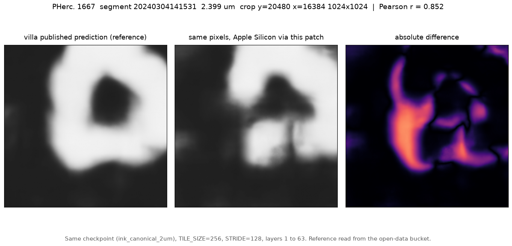

# Apple Silicon support for villa's ink detection inference

`villa/ink-detection/optimized_inference` selects its device with

```python
device = torch.device("cuda" if torch.cuda.is_available() else "cpu")
```

There is no MPS branch, so every Apple Silicon Mac silently takes the CPU path.
Downstream of that, the autocast device type is chosen as

```python
amp_device = "cuda" if device.type == "cuda" else "cpu"
```

which, when the tensors are on MPS, makes autocast a no-op rather than an
error.

This repository holds a small patch that adds the MPS path, plus the
measurements behind it and a local runner that needs no container and no AWS
credentials. Everything is measured on real scroll data: PHerc. 1667, segment
`20240304141531-w013_20240304141531_flatboi`, the 2.399 um surface volume, with
`scrollprize/ink_canonical_2um` (`r152_3ddec_v2_l5_epoch13.ckpt`).

## What it buys

Same checkpoint, same tiles, `TILE_SIZE=256`, `STRIDE=128`, layers 1 to 63,
loaded through villa's own `model_resnet3d_3d_decoder.load_model`.

Nine timed repetitions per MPS configuration and three for CPU, after an
untimed warmup, reported as min / median / max per villa's `AGENTS.md` rule
1.4 rather than as a bare mean.

| path | min | **median** | max | forward memory |
|---|---|---|---|---|
| CPU, fp32, what a Mac gets today | 3.259 | **3.261** | 3.278 | **9.52 GB** |
| MPS, autocast off | 0.524 | 0.525 | 0.526 | 2.59 GB |
| MPS, villa's current `amp_device` | 0.525 | 0.526 | 0.527 | 2.59 GB |
| MPS, `amp_device` corrected | 0.426 | **0.427** | 0.428 | 7.85 GB at batch 4 |

Seconds per tile. **7.63x faster.** Note rows two and three: villa's current
autocast line times identically to autocast being switched off, which is the
same no-op shown numerically below. The memory number matters more than the speed one. The CPU
path costs about **9.9 GB per tile** (9.52 GB at batch 1, 19.89 GB at batch 2),
so on a 16 GB Mac one tile barely fits and two do not. MPS at batch 4 needs
7.85 GB. For most Macs this is the difference between running the inference and
not running it.

Each configuration was measured in a **fresh process**, because `ru_maxrss` is
a process-wide high-water mark and a single-process sweep reports the maximum
of everything that ran before it. A first attempt did exactly that and its
memory column was meaningless.

### Why the CPU path is so expensive

Sampling the CPU run shows the time going into
`at::native::slow_conv3d_forward_out_cpu` and `cpublas_gemm_impl`. PyTorch has
no optimised 3D convolution kernel for this case on arm64, so it falls back to
the reference implementation. The patch does not fix that; it is the reason the
MPS path is worth having.

### A separate finding, worth its own look: CPU autocast is catastrophic on arm64

This one is not about Apple Silicon specifically and the patch deliberately
does **not** change it, because changing CPU behaviour would alter what every
existing CPU user gets.

`inference.py` wraps the forward in `torch.autocast(device_type=amp_device,
enabled=True)`, and on any non-CUDA device `amp_device` is `"cpu"`. On arm64
that routes the 3D convolutions into a **bfloat16** reference kernel:

| CPU forward, one tile, batch 1 | seconds |
|---|---|
| fp32, autocast off | **3.47** |
| bf16, via `torch.autocast(device_type="cpu")` | **killed at 714, still running** |

That is a penalty of **at least 206x**, and it is a lower bound rather than a
measurement because the run was killed rather than completed. Attributed by
sampling, not assumed: the stack shows `BFloat16` symbols above
`at::native::slow_conv3d_forward_out_cpu` and `cpublas_gemm_impl`, so bf16 uses
the same reference convolution with no optimised GEMM behind it.

The practical effect is that a 49-tile crop that takes 21 s on MPS did not
finish in 33 minutes on CPU. Anyone running this on an arm64 CPU is likely to
read that as a hang. Whether the right fix is to disable autocast on CPU, gate
it on architecture, or leave it is a call for the maintainers, so this is
reported rather than patched.

### The autocast line is a silent no-op, not just mis-specified

Running autocast with `device_type="cpu"` while the tensors are on MPS produces
output **bit-identical to fp32**, max absolute difference exactly `0.0`. With
`device_type="mps"` the output differs by `1.24e-03`, which is fp16 magnitude,
and it is 1.23x faster. So Apple Silicon users are not getting a slightly wrong
autocast, they are getting none at all, with no error and no warning.

## Correctness

The ported path was checked against villa's own published prediction for the
same segment
(`...new_canon_autoresearch_recipe-tile256-stride128.tif` in the open-data
bucket), which is on the same 41600 x 79600 grid as the level-0 surface, so a
crop maps onto it one to one.

| comparison | Pearson | Spearman |
|---|---|---|
| **aligned, same pixels** | **0.8521** | **0.8350** |
| reference shifted right one crop | 0.4232 | 0.3991 |
| reference shifted down one crop | 0.2283 | 0.2510 |
| a far region of the reference | -0.0597 | -0.0687 |
| same crop, pixels shuffled | 0.0008 | -0.0052 |

The shifted comparisons score above zero because neighbouring crops share
papyrus sheet structure, which is why the shuffle is also there.

**This is a reproduction, not bit-equality, and the gap is not explained.** The
published file is named `new_canon_autoresearch_recipe`, which may not be the
`ink_canonical_2um` checkpoint used here, and crop-edge blending differs from a
whole-segment run.

**The first comparison run was worthless and nearly passed.** A crop at
y=20000, x=40000 gave an aligned r of 0.0688 while still beating every control.
The reference has a standard deviation of 0.0116 there: a blank region with no
ink cannot tell a correct port from a broken one. Scanning 100 windows of the
reference put the ink-bearing regions at up to 0.3664, about 30x higher, and
the numbers above come from one of those.



## Also here: running it locally

`entrypoint.py` assumes `/workspace` and a credentialed `boto3` client, so it
cannot be run outside the container. `bench/run_local.py` reads a crop straight
from `s3://vesuvius-challenge-open-data/` anonymously and hands it to villa's
own `run_inference` unmodified, with no container and no credentials:

```bash
python bench/run_local.py --y0 20480 --x0 16384 --size 1024
```

Two notes for anyone reading zarr from that bucket:

- zarr 3 needs an **async** fsspec filesystem. Use
  `zarr.storage.FsspecStore.from_url("s3://...", storage_options={"anon": True})`;
  passing a plain `S3FileSystem` raises `Filesystem needs to support async
  operations`.
- `s3fs` must be recent. Installing without a version bound can resolve
  `s3fs==0.4.2`, which fails with
  `Session.__init__() got an unexpected keyword argument 'asynchronous'`.
  villa's own `requirements.txt` already pins `>=2024.3.0`; this is only a
  warning for anyone installing by hand.

## The patch

`device_utils.py` plus six changed lines, in `villa-apple-silicon.patch`.

- `select_device()`: cuda, then mps, then cpu, with an `INK_DEVICE` override.
- `amp_device_type(device)`: follows the device the tensors are actually on,
  and falls back to `cpu` for anything it does not recognise.
- `sync(device)` and `empty_cache(device)` so timing and cache clearing are not
  cuda-only.

## Controls

`bench/verify_port.py`, 12 checks, 0 failures. The check that matters is not
"does MPS work", it is **"is the CUDA path unchanged"**, since that is the path
every existing user is on.

**Stated plainly: there is no CUDA hardware here, so the CUDA path is verified
by unit test and by construction, never by execution.** `amp_device_type` is
asserted on every branch and `select_device` is tested with
`torch.cuda.is_available` monkeypatched to `True`. A positive control watches
villa's original expression returning `"cpu"` for an MPS device, so if that is
ever fixed upstream the control fails loudly instead of passing vacuously.

## Honest negatives

- **Batching buys almost nothing on MPS.** Throughput is flat from batch 1 to
  16 (2.33 to 2.39 tiles/s), so the model already saturates the GPU at batch 1.
  Batch 16 needs 27.08 GB of driver-allocated memory for a 1.25x gain. Batch 4
  is the sensible default.
- `torch.compile` does work on MPS in both `reduce-overhead` and `default`
  modes, warmup 14.1 s and 12.5 s, output matching eager to `1.36e-03`. It
  emits CUDA-specific warnings ("Not enough SMs", "skipping cudagraphs due to
  multiple devices") which are cosmetic.
- MPS refuses `float64`. Nothing in this path hits it, but anything that does
  will need casting.

## Reproducing

```bash
git clone https://github.com/ScrollPrize/villa.git
uv venv env --python 3.11
uv pip install --python ./env/bin/python torch numpy scipy tqdm \
  opencv-python-headless tifffile psutil huggingface_hub boto3 \
  "s3fs>=2025.1.0" fsspec zarr numcodecs imagecodecs albumentations matplotlib
git -C villa apply ../villa-apple-silicon.patch

./env/bin/python bench/feasibility.py      # what MPS supports, and the bucket
./env/bin/python bench/verify_port.py      # the 12 controls
./env/bin/python bench/bench_device.py     # CPU vs MPS, with a negative control
./env/bin/python bench/run_local.py        # a real crop, end to end
./env/bin/python bench/compare_reference.py --y0 20480 --x0 16384 --tag ink
```

Measured on an M1 Max, 64 GB, macOS 26.6, torch 2.14.0, python 3.11.15.

MIT licensed, same as villa.
